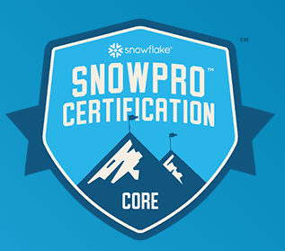

# [SNOWPRO CORE CERTIFICATION](https://www.snowflake.com/certifications/)

- The SnowPro Core Certification demonstrates an individual’s knowledge to apply core expertise implementing and migrating to Snowflake.

## Steps to Success

1. [ ] [Review Exam Guide](https://learn.snowflake.com/courses/course-v1:snowflake+CERT-SPC-GUIDE+B/about?_ga=2.22288187.1493617847.1661798572-1202842695.1661265529)
2. [x] [Download Study Guide](https://learn.snowflake.com/courses/course-v1:snowflake+SPSG-CORE+B/about?_ga=2.35208737.1493617847.1661798572-1202842695.1661265529)
3. [ ] [CHeck out the paid on-demand prep course](https://training.snowflake.com/?_ga=2.35208737.1493617847.1661798572-1202842695.1661265529)
4. [ ] [Review exam registration instructions](https://learn.snowflake.com/courses/course-v1:snowflake+CERT-SPC-GUIDE+B/about?_ga=2.35208737.1493617847.1661798572-1202842695.1661265529)
5. [ ] [Register](https://home.pearsonvue.com/snowflake)

---

## Core Certification Candidate (New version of exam September 2022)

- Data Loading and Transformation in Snowflake
- Virtual Warehouse Performance and Concurrency
- DDL and DML Queries
- Using Semi-Structured and Unstructured Data
- Cloning and Time Travel
- Data Sharing
- Snowflake Account Structure and Management

## Exam Format

- Exam Version: COF-C02
- Total Number of Questions: 100
- Question Types: Multiple Select, Multiple Choice
- Time Limit: 115 minutes
- Languages: English
- Registration Fee: $175 USD
- Passing Score: 750 + Scaled Scoring from 0 - 1000
- Unscored Content: Exams may include unscored items to gather statistical information. These items are not identified on the form and do not affect - your score, and additional time is factored in to account for this content.
- No Prerequisites
- Delivery Options:
  - Online Proctoring
  - Onsite Testing Centers

## Exam Domain Breakdown

| Domain                                                  | Estimated Percentage Range |
| :------------------------------------------------------ | :------------------------: |
| Snowflake cloud data platform features and architecture |           20-25%           |
| Account access and security                             |           20-25%           |
| Performance concepts                                    |           10-15%           |
| Data loading and unloading                              |           5-10%            |
| Data transformations                                    |           20-25%           |
| Data protection and data sharing                        |           5-10%            |

### Domain 1.0: Snowflake Data Platform Features and Architecture

- 1.1 Outline key features of the Snowflake Cloud Data Platform.
  - Elastic Storage
  - Elastic Compute
  - Snowflake’s three distinct layers
  - Data Cloud/ Data Exchange/ Partner Network
  - Cloud partner categories
- 1.2 Outline key Snowflake tools and user interfaces.
  - Snowflake User Interfaces (UI)
  - Snowsight
  - Snowflake connectors
  - Snowflake drivers
  - SQL scripting
  - Snowpark
- 1.3 Outline Snowflake’s catalog and objects.
  - Databases
  - Schemas
  - Tables Types
  - View Types
  - Data types
  - User-Defined Functions (UDFs) and User Defined Table Functions (UDTFs)
  - Stored Procedures
  - Streams
  - Tasks
  - Pipes
  - Shares
- 1.4 Outline Snowflake storage concepts.
  - Micro partitions
  - Types of column metadata clustering
  - Data Storage Monitoring
  - Search Optimization Service

### Domain 2.0: Account Access and Security

- 2.1 Outline compute principles.
  - Network security and policies
  - Multi-Factor Authentication (MFA)
  - Federated authentication
  - Single Sign-On (SSO)
- 2.2 Define the entities and roles that are used in Snowflake.
  - Outline how privileges can be granted and revoked
  - Explain role hierarchy and privilege inheritance
- 2.3 Outline data governance capabilities in Snowflake.
  - Accounts
  - Organizations
  - Databases
  - Secure views
  - Information schemas
  - Access history and read support

### Domain 3.0: Performance Concepts

- 3.1 Explain the use of the Query Profile.
  - Explain plans
  - Data spilling
  - Use of the data cache
  - Micro-partition pruning
  - Query history
- 3.2. Explain virtual warehouse configurations.
  - Multi-clustering
  - Warehouse sizing
  - Warehouse settings and access
- 3.3 Outline virtual warehouse performance tools.
  - Monitoring warehouse loads
  - Query performance
  - Scaling up compared to scaling out
  - Resource monitors
- 3.4 Optimize query performance.
  - Describe the use of materialized views
  - Use of specific SELECT commands

